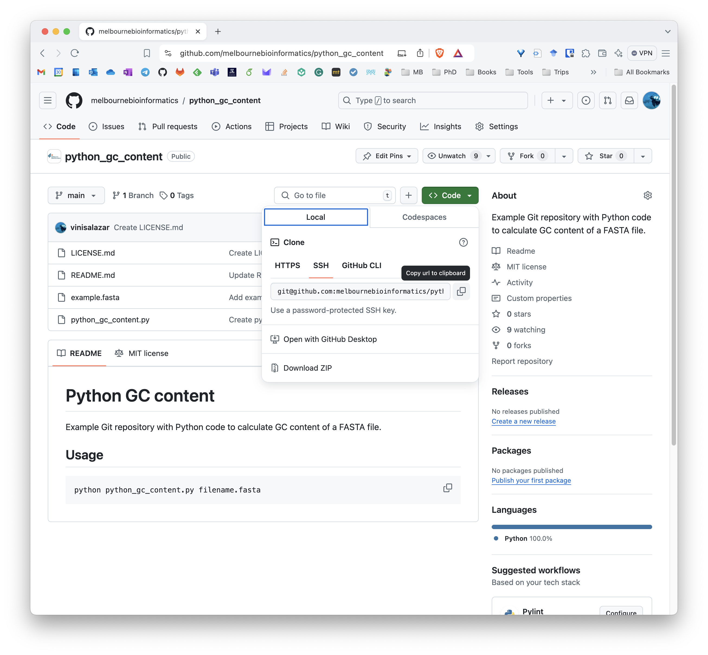
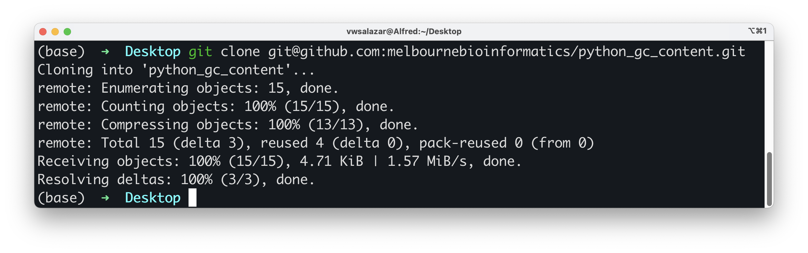
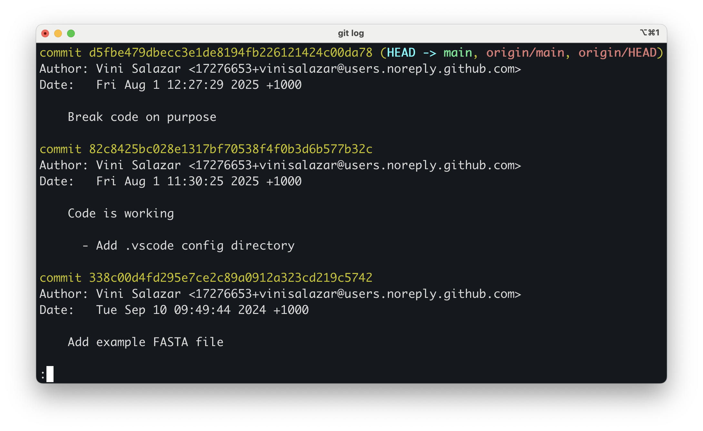

:::::::::::::::::::::::::::::::::::::: questions 

- How do we collaborate with Git?
- How do we get code from GitHub into our computer?
- How do we revert changes that we do not want?

::::::::::::::::::::::::::::::::::::::::::::::::

::::::::::::::::::::::::::::::::::::: objectives

- *Clone* a repository and the `git clone` command.
- *Pull* changes and the `git pull` command.
- Revert a change that was made and broke the code.

::::::::::::::::::::::::::::::::::::::::::::::::

To start, we have two repositories to choose from, one in **Python** and one in **R**. Both repositories contain the same thing: a script that calculates the GC content of the sequences in a given FASTA file. Pick the language that you're most comfortable with to proceed:

- [**Python repository**](https://github.com/melbournebioinformatics/python_gc_content)
- [**R repository**](https://github.com/melbournebioinformatics/R_gc_content)

Take a note of the contents of each repository:
- A README file
- The script with the code
- An example data file
- A LICENSE file

Clone your chosen repository locally using the `git clone` command.

::::::::::::::::::::::::::::::::::::: checklist

### Cloning a repository

1. Click the `< > Code` button on the top right of the repository's contents.



This copies the remote's URL to your clipboard.

2. Navigate to a suitable directory (**not** inside our previous `gitgood` repository), such as the Desktop directory, and run `git clone <URL>`



:::::::::::::::::::::::::::::::::::::

Well done! You now have a local copy of the code. Cloning is a powerful feature that allows us to effortlessly create a copy of an existing repository. If you make your code available on GitHub, people can clone it and customise it.

### Undoing changes

Now, let's try running the code in the repository:

::::::::::::::::::::::::::::::::::::: tab

### Python

```bash
python python_gc_content.py example.fasta
```

### R

```bash
Rscript R_gc_content.R example.fasta
```

:::::::::::::::::::::::::::::::::::::

You most likely got an error message like this one:

::::::::::::::::::::::::::::::::::::: tab

### Python

```output
File "/path/to/python_gc_content/python_gc_content.py", line 45
   print(f"Overall GC Content: {gc_content:.2f}%"
         ^
SyntaxError: '(' was never closed
```

### R

```output
Error: unexpected '}' in:
"  cat(sprintf("Overall GC Content: %.2f%%\n", gc_content)
}"
Execution halted
```

:::::::::::::::::::::::::::::::::::::

Let's explore the log on the repository. Run `git log`:



Apparently, the last commit purposefully breaks the code so that we can fix it ourselves! We wouldn't know that if it weren't for a descriptive commit message.

Now, there are two things we could do:

1. Revert back to the previous commit. After all, version control would not be useful if we could not go back to a previous, working version of our code.
2. Fix the code ourselves and commit the changes.

There are multiple ways to revert changes in Git. Here, we will use the `git reset` command:

```bash
git reset --soft HEAD~1
```

There's a lot to unpack here. First is the `git reset` command itself. What it does is that it resets the **current state** of the repository, also called `HEAD`, to a specified state. In this case, we are resetting to one commit before the current state, hence `HEAD~1`. The `--soft` flag tells the command to undo the commit, but keep the changes in the staged area. Let's run `git status` to see what it shows:

```bash
git status
```

```
On branch main
Your branch is behind 'origin/main' by 1 commit, and can be fast-forwarded.
  (use "git pull" to update your local branch)

Changes to be committed:
  (use "git restore --staged <file>..." to unstage)
        modified:   python_gc_content.py
```

The changes from the commit that we reset are staged, but the commit itself was undone (you can see with `git log`). We can see exactly what that change was by running `git diff --staged`, which is just like `git diff` that we learned before, but highlights only the changes that are already staged.

```bash
git diff --staged
```

::::::::::::::::::::::::::::::::::::: tab

### Python

```output
diff --git a/python_gc_content.py b/python_gc_content.py
index 81aa457..8ec3fc4 100644
--- a/python_gc_content.py
+++ b/python_gc_content.py
@@ -42,7 +42,7 @@ def main():
   fasta_file = sys.argv[1]
   full_sequence = read_fasta(fasta_file)
   gc_content = calculate_gc_content(full_sequence)
-    print(f"Overall GC Content: {gc_content:.2f}%")
+    print(f"Overall GC Content: {gc_content:.2f}%"

if __name__ == "__main__":
   main()
```

### R

```output
diff --git a/R_gc_content.R b/R_gc_content.R
index abb31f4..e6fe7f0 100644
--- a/R_gc_content.R
+++ b/R_gc_content.R
@@ -26,7 +26,7 @@ main <- function() {
   full_sequence <- read_fasta(fasta_file)
   gc_content <- calculate_gc_content(full_sequence)

-  cat(sprintf("Overall GC Content: %.2f%%\n", gc_content))
+  cat(sprintf("Overall GC Content: %.2f%%\n", gc_content)
}

# Call main function if script is run
```

:::::::::::::::::::::::::::::::::::::

We can see that the code broke because, in the previous commit, a parenthesis was removed from a line. However, because that change is staged, the code remains broken. We can undo the staged change by running:

```bash
git restore --staged <file>
```

This removes the file from the staging area, but the change is still there (you can check it using `git status`).

To fully restore the file to its previous state, you can run:

```bash
git restore <file>
```

<!-- ::::::::::::::::::::::::::::::::::::: callout 

**Git reset alternatives**

Running these two commands, that is, to unstage and restore the changes after `git reset`, would be the equivalent of running:

```bash
git reset --hard HEAD~1
```

In this case, using the `--hard` flag undoes all of the changes from the current state (the `HEAD`) to the specified state (in this case, one commit previous to the `HEAD`). The reason we may want to use `--soft` instead of `--hard` is that sometimes we may not want to lose all of our uncommitted changes, but rather review them on a case-by-base basis.

Another thing we could do is:

```bash
git checkout HEAD~1
```

The `git checkout` command is use to transition between **branches**. We haven't gone into the concept of branches yet so we will leave this one alone for now. But basically, by using `git checkout`, we can navigate between the repository at different points in time (that is, at each commit).

::::::::::::::::::::::::::::::::::::: -->

Now that we have fully restored the breaking changes, let's try running the code again:

::::::::::::::::::::::::::::::::::::: tab

### Python

```bash
python python_gc_content.py example.fasta
```

### R

```bash
Rscript R_gc_content.R example.fasta
```

:::::::::::::::::::::::::::::::::::::

The result should be:

```output
Overall GC Content: 57.98%
```

This was the first way that we could fix what wrong with the code, by reverting to a previous version that we know that worked. Let's try the second approach, of fixing the change ourselves in a new commit. First, let's undo what we did by running `git reset`. By doing that, we moved to a previous commit in time. That means that our local copy is **one commit behind the remote**. So, we can go back to the broken version simply by running:

```bash
git pull
```

This will sync the remote with the local.


::::::::::::::::::::::::::::::::::::: challenge

Now, try perfoming the fix yourself. Once you make sure that the new code works, run `git add`, `git commit`. Raise your hand or put up a green post-it when you are done.

::::::::::::::::::::::::::::::::::::: solution

::::::::::::::::::::::::::::::::::::: tab

### Python

```bash
python python_gc_content.py example.fasta
```

### R

```bash
Rscript R_gc_content.R example.fasta
```

:::::::::::::::::::::::::::::::::::::

:::::::::::::::::::::::::::::::::::::

:::::::::::::::::::::::::::::::::::::

**Well done!** You fixed a broken a script and committed the result using Git. That is no easy feat! It will pave your way to making more contributions in the future.

After making sure that the code works, push your changes using `git push`. What happens then?

Because the repository that we cloned is under Melbourne Bioinformatics, we don't have write access to it. In order to push the code to GitHub, we need our own copy of the code, so we must **fork** the repository. Let's see how to do that.


::::::::::::::::::::::::::::::::::::: keypoints 

- `git clone` copies a remote repository to our local repository.
- There are multiple ways to revert to previous changes, one of them is `git reset`.
- `HEAD` indicates the current state of the repository.
- We cannot push to a remote repository if we do not have access to it.

::::::::::::::::::::::::::::::::::::::::::::::::

