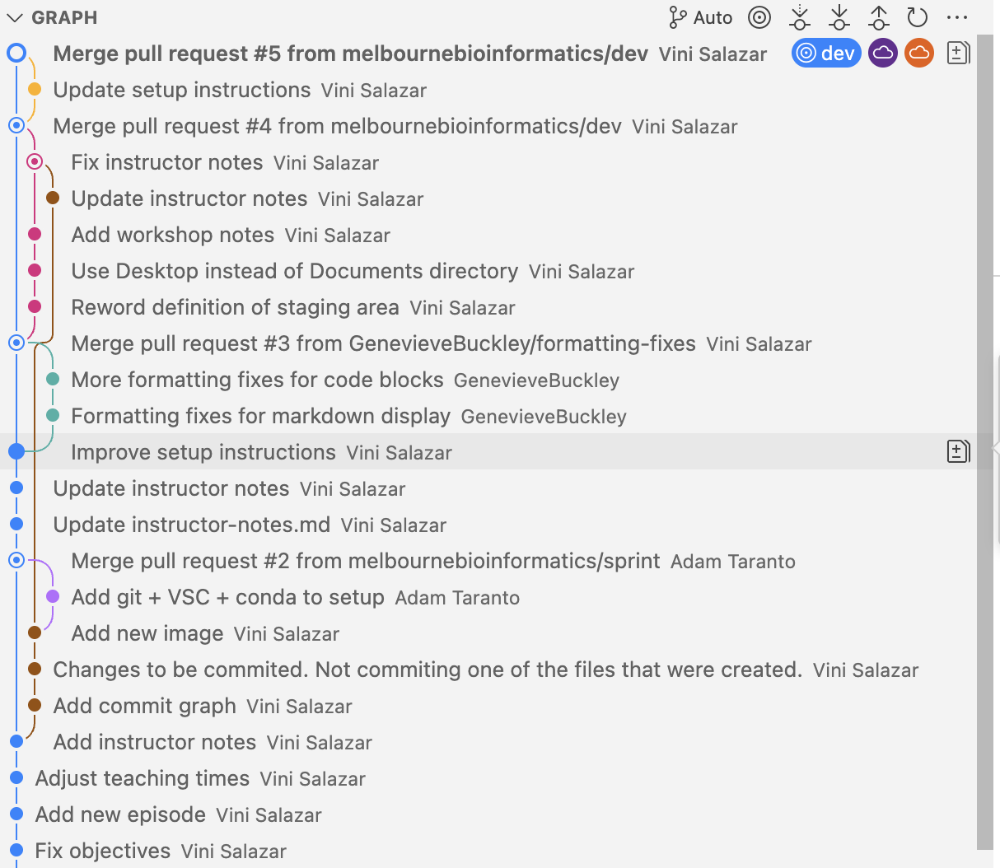
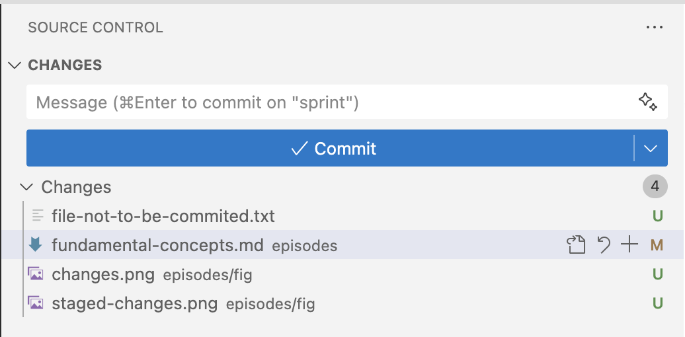
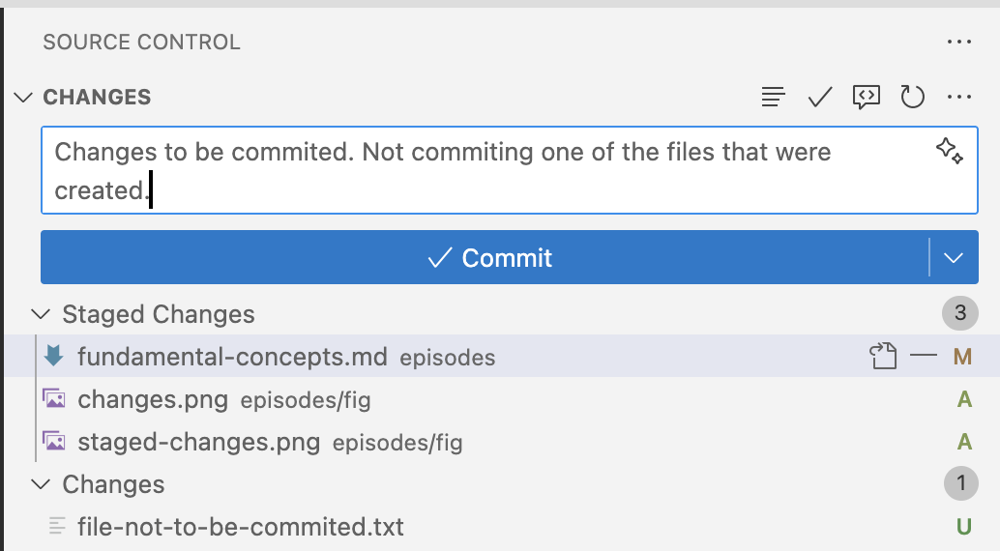

:::::::::::::::::::::::::::::::::::::: questions 

- What are the fundamental concepts of version control?
- What are commits?
- What are remotes?
- What is the staging area?
- What are branches?

::::::::::::::::::::::::::::::::::::::::::::::::

::::::::::::::::::::::::::::::::::::: objectives

- Understand the fundamental concepts of Git, such as commits, remotes, and the staging area.
- Be able to explain concepts with the "shopping cart" analogy.

::::::::::::::::::::::::::::::::::::::::::::::::

Before we get started with hands-on work, let's understand some basic concepts about Git. We've already learned that Git tracks different versions of a project by using **commits**, which are like **snapshots of a project**. But let's take a closer look on how this works in practice, by learning about [remotes](../learners/reference.md#glossary) and [the staging area:](../learners/reference.md#glossary)

### Remotes
Think of remotes as "cloud copies" of your Git repository. While you have your project on your local computer, a remote is a version stored on platforms like GitHub or GitLab. Remotes allow multiple people to work on the same project, sharing updates by pushing changes to the remote and pulling others' changes from it. For example, you can push your work to a remote to back it up or collaborate with teammates by pulling their changes into your local project.

### Staging area
If we think of a commit as a transaction, the staging area in Git is like a "shopping cart" for the changes you want to commit. When you modify files, those changes don’t go directly into a commit. Instead, you first add them to the staging area, where you can review and decide what will be included in your next commit. It gives you control to commit only specific changes rather than everything at once. Think of it as preparing ingredients on the counter before putting them into a recipe—you only add what you need.

### Branches
Branches are what enable Git to be used as a collaborative tool. They are like separate “workbenches” where you can experiment and make changes without affecting the main project. Just as the staging area is your shopping cart for preparing what goes into a commit, a branch is like a separate checkout lane—your own path to develop or test features safely. Each branch starts from an existing point in the project’s history and can evolve independently, as shown in the graph above: each colored line represents a different branch of work. When a branch is ready, it can be merged back into the main branch, combining all your changes into the shared project history.

### Using the VS Code extension

We can see the changes in the VS Code "Source Control" tab. In the following example, we've modified an existing file, and added a new file with an image:

{alt='Source control tab showing modified file and a new file.'}

After we move the files to the staging area, they are ready to be commited:

{alt='Source control tab showing changes in the staging area.'}

:::::::::::::::::::::::::::::::::::::: keypoints

- **Commits** are snapshots of a repository.
- We can have a copy of our repository in a different location, called a **remote**. We can send ("push") and receive ("pull") changes from the remote to interact with others' work, and also to back up or update our local copy.
- The **staging area** is where we keep track of the changes that we are going to commit, that is, which are going to be written in the repository history.
- **Branches** are isolated timelines of a repository, where people can work in parallel.

::::::::::::::::::::::::::::::::::::::
