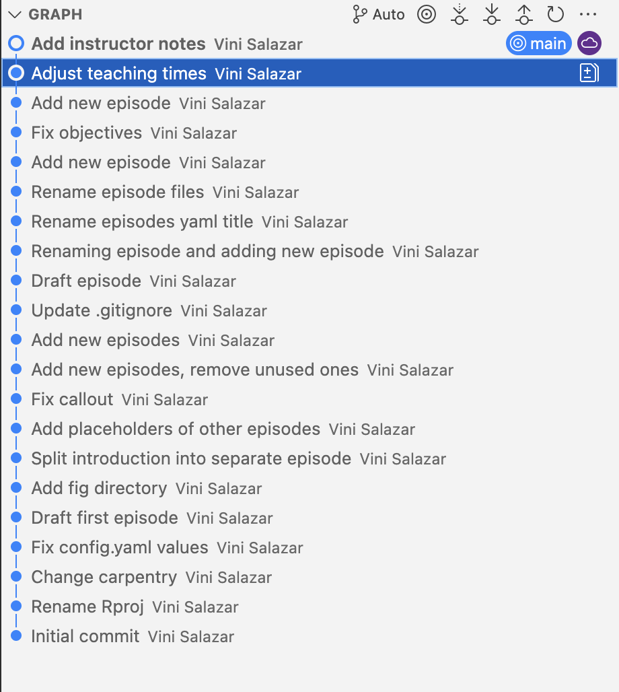

:::::::::::::::::::::::::::::::::::::: questions 

- What is Git?
- What problem does it solve?

::::::::::::::::::::::::::::::::::::::::::::::::

::::::::::::::::::::::::::::::::::::: objectives

- Understand what Git is, and what it is used for.
- Understand some of its features that make it so attractive.

::::::::::::::::::::::::::::::::::::::::::::::::

## Introduction

### What is Git?
A concise definition is that Git is a **version control system**. It was developed in the early 2000s by 
Linus Torvalds, the person behind the Linux kernel, and other members of the Linux community. In fact, the initial purpose of
Git was to support the development and updates of the Linux kernel.

Git is attractive because of several things:

* It is **fully distributed**. What this means is that several (hundreds, thousands) of users can work on the same project in a streamlined way.
* It is **blazing fast**. Because (nearly) every operation that Git performs is local, everything works almost instantaneously.
* It has **integrity**. Git checksums data before storing it, so it's impossible to change the content of files without knowing about it.

This is all well and good, but let's try to understand what version control means for us as researchers.

](fig/phd101212s.png)

We've all been in this situation before: it seems unnecessary to have
multiple nearly-identical versions of the same document. Some word
processors let us deal with this a little better, such as Microsoft
Word's
[Track Changes](https://support.office.com/en-us/article/Track-changes-in-Word-197ba630-0f5f-4a8e-9a77-3712475e806a),
Google Docs' [version history](https://support.google.com/docs/answer/190843?hl=en), or
LibreOffice's [Recording and Displaying Changes](https://help.libreoffice.org/Common/Recording_and_Displaying_Changes).

Version control systems start with a base version of the document and
then record changes you make each step of the way. You can
think of it as a recording of your progress: you can rewind to start at the base
document and play back each change you made, eventually arriving at your
more recent version.

{alt='A diagram demonstrating how a single document grows as the result of sequential changes'}

Once you think of changes as separate from the document itself, you
can then think about "playing back" different sets of changes on the base document, ultimately
resulting in different versions of that document. For example, two users can make independent
sets of changes on the same document.

{alt='A diagram with one source document that has been modified in two different ways to produce two different versions of the document'}

Unless multiple users make changes to the same section of the document - a 
[conflict](../learners/reference.md#glossary) - you can
incorporate two sets of changes into the same base document.

{alt='A diagram that shows the merging of two different document versions into one document that contains all of the changes from both versions'}

A version control system is a tool that keeps track of these changes for us,
effectively creating different versions of our files. It allows us to decide
which changes will be made to the next version (each record of these changes is
called a [commit](../learners/reference.md#glossary), and keeps useful metadata
about them. The complete history of commits for a particular project and their
metadata make up a [repository](../learners/reference.md#glossary).
Repositories can be kept in sync across different computers, facilitating
collaboration among different people.

This is how the history of commits looks for this website that you are looking at:

{alt='How the commit graph looks for this website.'}

:::::::::::::::::::::::::::::::::::::: discussion 

**The Long History of Version Control Systems**

Automated version control systems are nothing new.
Tools like [RCS](https://en.wikipedia.org/wiki/Revision_Control_System), [CVS](https://en.wikipedia.org/wiki/Concurrent_Versions_System), or [Subversion](https://en.wikipedia.org/wiki/Apache_Subversion) have been around since the early 1980s and are used by
many large companies.
However, many of these are now considered legacy systems (i.e., outdated) due to various
limitations in their capabilities.
More modern systems, such as Git and [Mercurial](https://swcarpentry.github.io/hg-novice/),
are *distributed*, meaning that they do not need a centralized server to host the repository.
These modern systems also include powerful merging tools that make it possible for
multiple authors to work on
the same files concurrently.

::::::::::::::::::::::::::::::::::::::

:::::::::::::::::::::::::::::::::::::: challenge 

**Paper Writing**

- Imagine you drafted an excellent paragraph for a paper you are writing, but later ruin it. How would you retrieve the *excellent* version of your conclusion? Is it even possible?
- Imagine you have 5 co-authors. How would you manage the changes and comments they make to your paper? If you use LibreOffice Writer or Microsoft Word, what happens if you accept changes made using the `Track Changes` option? Do you have a history of those changes?

:::::::::::::::::::::::::::::::::::::: solution

Recovering the excellent version is only possible if you created a copy of the old version of the paper. The danger of losing good versions often leads to the problematic workflow illustrated in the PhD Comics cartoon at the top of this page. Collaborative writing with traditional word processors is cumbersome. Either every collaborator has to work on a document sequentially (slowing down the process of writing), or you have to send out a version to all collaborators and manually merge their comments into your document. The 'track changes' or 'record changes' option can highlight changes for you and simplifies merging, but as soon as you accept changes you will lose their history. You will then no longer know who suggested that change, why it was suggested, or when it was merged into the rest of the document. Even online word processors like Google Docs or Microsoft Office Online do not fully resolve these problems.

::::::::::::::::::::::::::::::::::::::

::::::::::::::::::::::::::::::::::::::

:::::::::::::::::::::::::::::::::::::: keypoints

- Version control is like an unlimited ‘undo’.
- Version control also allows many people to work in parallel.

::::::::::::::::::::::::::::::::::::::
