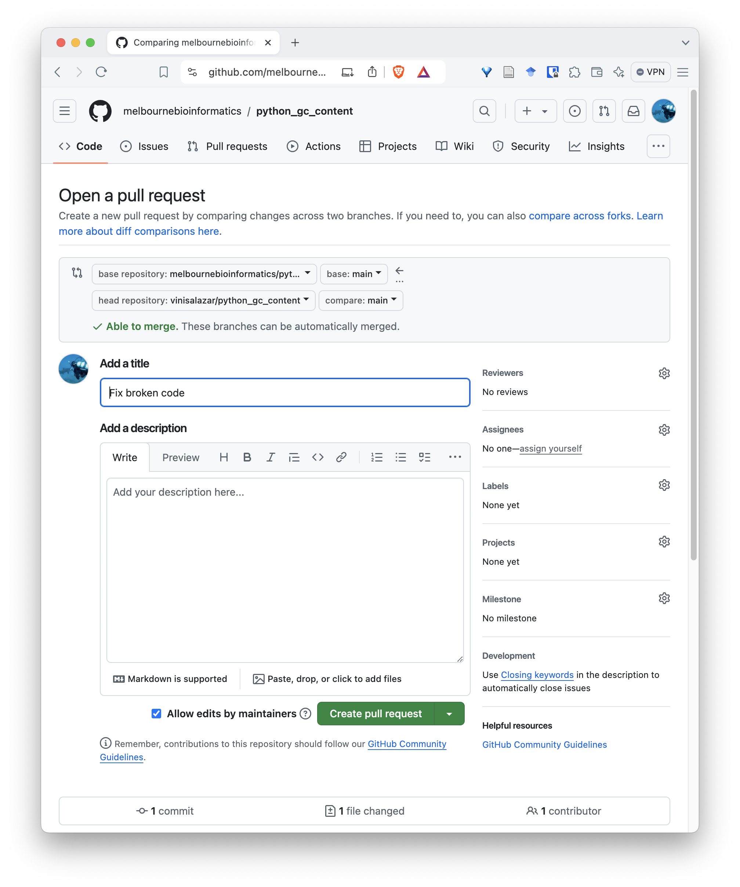
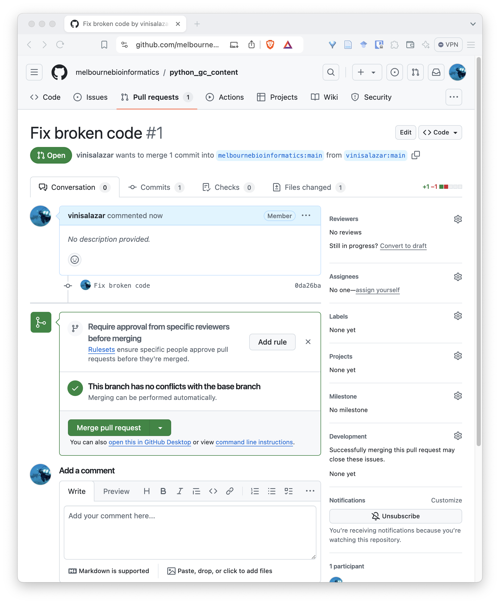
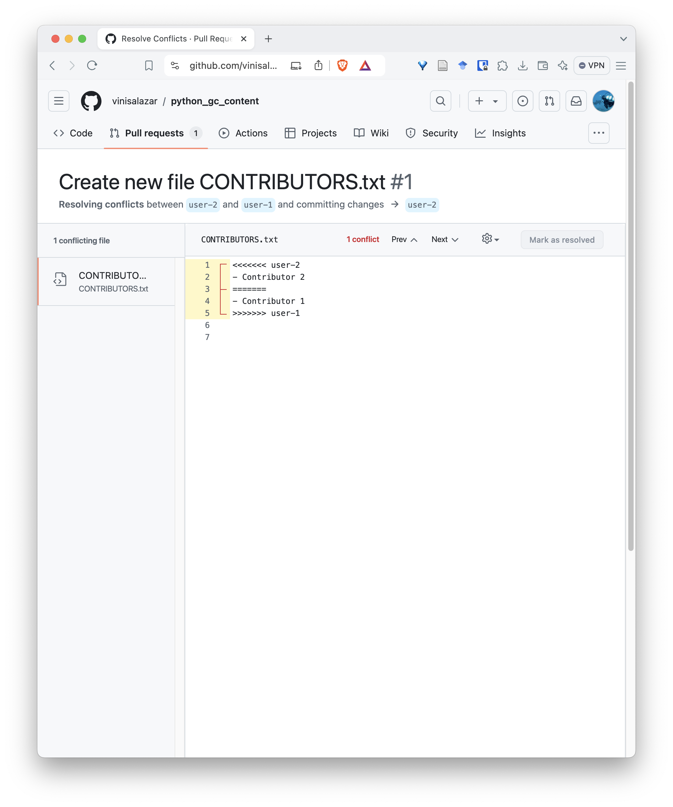
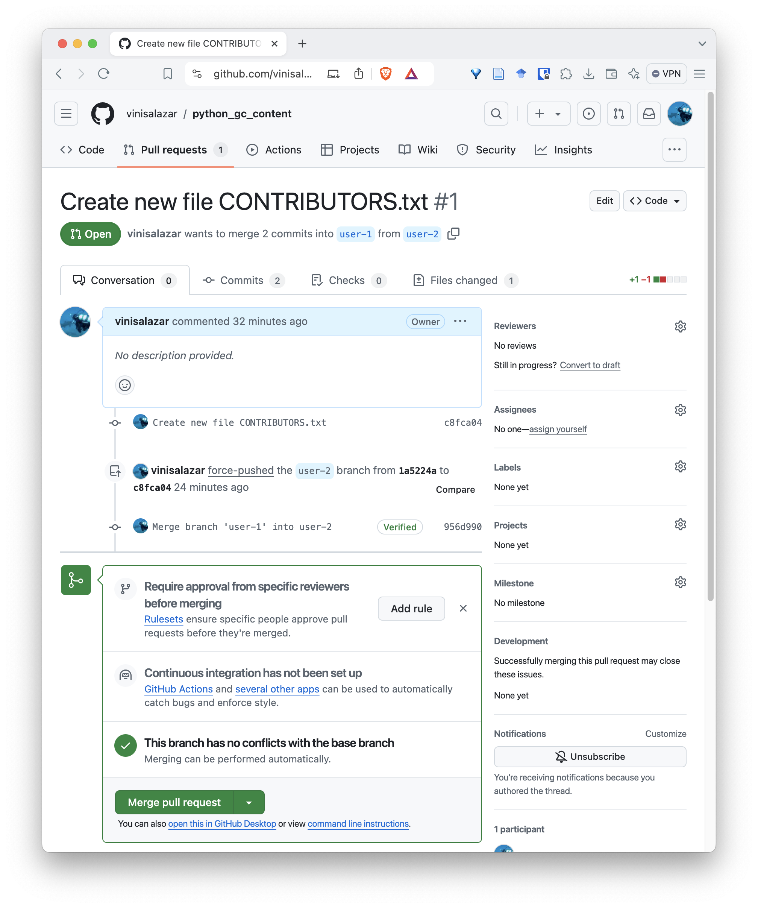
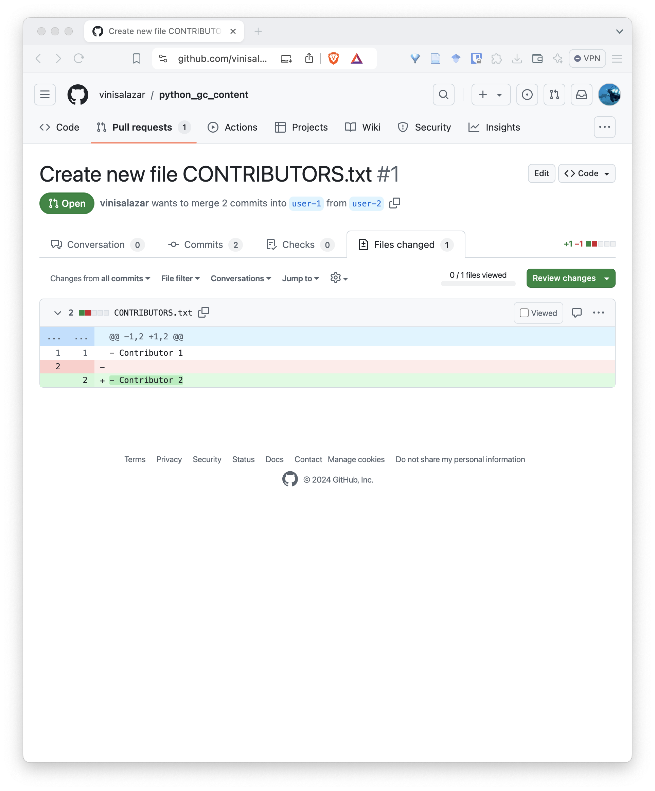
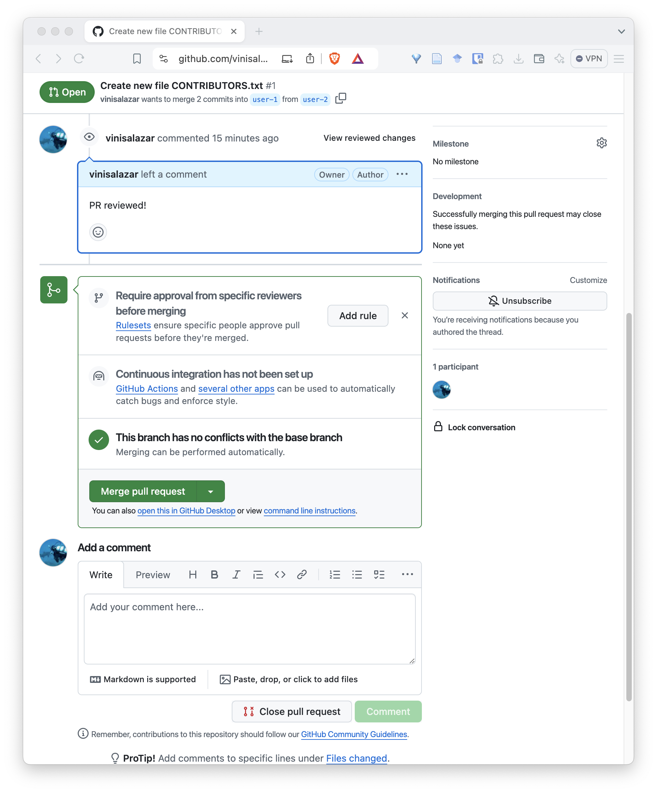

:::::::::::::::::::::::::::::::::::::: questions 

- What does *forking* a repository mean?
- What is a *merge conflict*?

::::::::::::::::::::::::::::::::::::::::::::::::

::::::::::::::::::::::::::::::::::::: objectives

- Fork a repository and make changes to it.
- Fix a merge conflict in your fork.

::::::::::::::::::::::::::::::::::::::::::::::::

When we **clone** a repository, we download a copy of it locally, attached to the same remote (the GitHub repository) from which we cloned it from. We can make whatever changes we want locally, but in order to push those changes to the remote, we must have access to the GitHub repository. Unless it's our own repository or the owner of the repository has granted us with write access, we usually won't have access to it. To circumvent this problem, we should [fork](#glossary) the repository. Forking a repository is similar to cloning, but we create a new **remote**, instead of a local copy, that we have control over.

Let's **fork** the chosen repository and make changes to it.

::::::::::::::::::::::::::::::::::::: checklist 

To fork a repository, navigate to the repository page on GitHub and click the "Fork" button on the top-right:


You will be taken to the fork page. There's no need to change anything here, but make sure you are forking it with your profile as the "Owner":


Now you have your own copy of the repository, that you have total control over! Notice that the top-left shows that the repository was forked from the original repository.


:::::::::::::::::::::::::::::::::::::

Now, there are two ways to configure your local repository so that it follows your **fork**, rather than the original repository:

::::::::::::::::::::::::::::::::::::: tab

### Deleting and re-cloning

Simply delete the local repository (with the `rm -rf <DIRECTORY_NAME>` or right-click the directory and delete it), and clone it again, using the same approach that we used before.

### Updating the remote

If you ran the `git remote -v` command from inside the original repository that you cloned, you will have seen that it shows the remote URL of the repository, which you do not have access to. You can **update** this remote with the following command: `git remote set-url origin <URL-OF-YOUR-FORK>`. The URL of your fork is the **same URL** that you use it to clone it, which can be obtained by clicking the "Code" button on the GitHub interface. Use `git remote -v` to confirm that the remote has been updated.

:::::::::::::::::::::::::::::::::::::

Now that your local repository is following the fork, rather than the original repository, you can **push** any changes that you make locally to the remote. Do this by running `git push`.

### Pull requests

Even though you don't have access to the original repository, you can submit changes to it through a [pull request](#glossary). A pull request is a way of requesting that the owner of the repository that you're submitting the changes to to "merge" (or pull) them into their repository.

Let's make a pull request with the fix that we made to the original repository containing the code. If you haven't pushed the code after committing the fix that you made, do so by running `git push`.

::::::::::::::::::::::::::::::::::::: checklist

To create a pull request, go to the page of your fork on GitHub after pushing the fixed code. At the top of the code, there will be a bar noting the difference between your fork and the original repository. If you click on "Contribute", you can create a pull request:


After you click that, you will be taken to a screen to create your pull request. A default title will be given to your PR, but you can edit it if you want, and give it a description. Repositories may have different policies regarding the content of the PR, but for this one we can just keep it simple and create the pull request:



Once you are done, you will have created a pull request from your fork into the original repository. It will appear on the "Pull requests" tab on the original repository. Authors and maintainers from that repository will be able to review your pull request, make comments, changes, and eventually merge it.



:::::::::::::::::::::::::::::::::::::

If you have your project available on GitHub, it is likely that you will have to review a pull request at some point!

### Merge conflicts

Because of that, let's practice **reviewing** a pull request, that is, the scenario where someone would submit a pull request to our repository.

::::::::::::::::::::::::::::::::::::: challenge

When a pull request is created that conflicts with your repository, the pull request screen should indicate it:


When clicking "Resolve conflicts", it should bring up a text editor where we can edit the conflicting file:



Conflicts on Git always follow this format, where the conflicting lines have `<<<`, `===`, and `>>>` between them, indicating where the conflict happens.

Erase the lines with `<<<`, `>>>` and `===` to fix the conflict. Make sure your name is the first line on the file, and the name of contributor, the second one. Your file should look like this:

```output
- User 1
- User 2
```

Click on "Resolve conflicts" and "Commit merge":


This will create a new commit on the pull request:



**Don't merge the pull request just yet!** Let's finish our review first.
 
::::::::::::::::::::::::::::::::::::: 

After fixing the conflict, let's review our pull request. On the pull request screen, go to the "Files changed" tab. 



This tab allows us to review each file individually. Check the "Viewed" checkbox next to the file, and the "Review changes". This allows you to Comment, Approve or Request changes on the pull request. Select Comment or Approve.


You can now merge the PR:



After merging, go to your local repository and run `git pull`.

**Well done!** By following this lesson so far, you've learned the fundamentals of version control with Git.

::::::::::::::::::::::::::::::::::::: keypoints 

- Forking a repository creates a new **remote** that we have control over.
- We can update the remote on our local repository using `git remote set-url <REMOTE_NAME> <REMOTE_URL>`.
- Pull requests are a way of collaborating that allows other people to merge our changes into their repository.
- Conflicts are when two commits modify the same parts of a file. We must resolve conflicts before merging them. This can be done by creating a new commit.
- Conflicts are denoted by `<<<`, `>>>` and `===` characters around the conflicting lines.

::::::::::::::::::::::::::::::::::::::::::::::::

