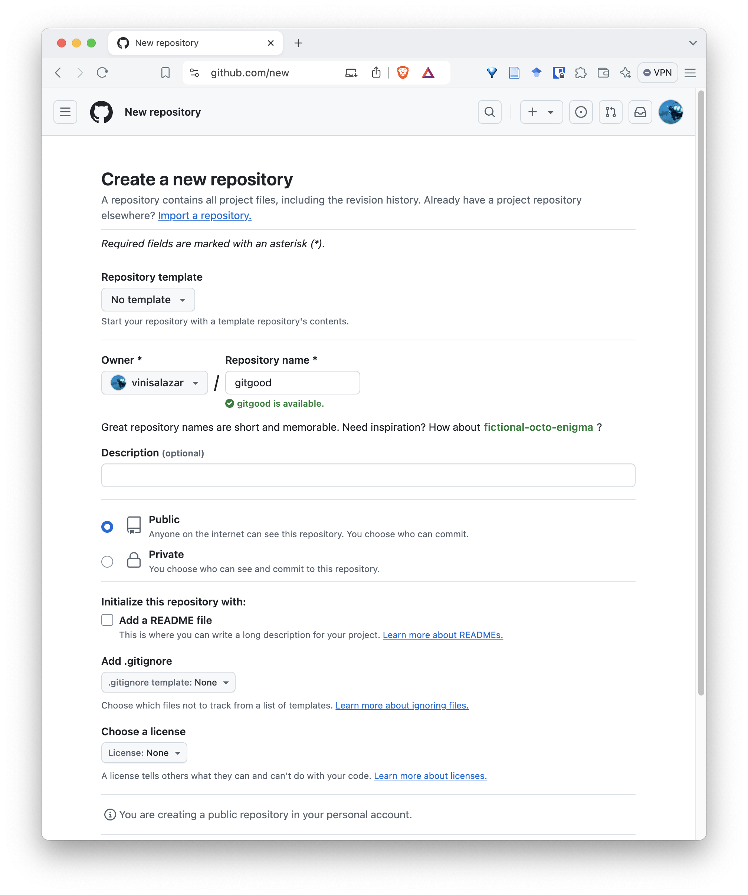
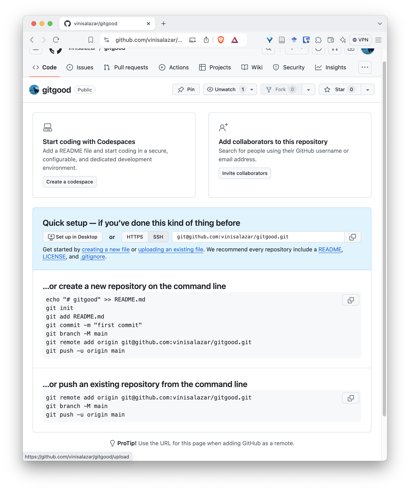
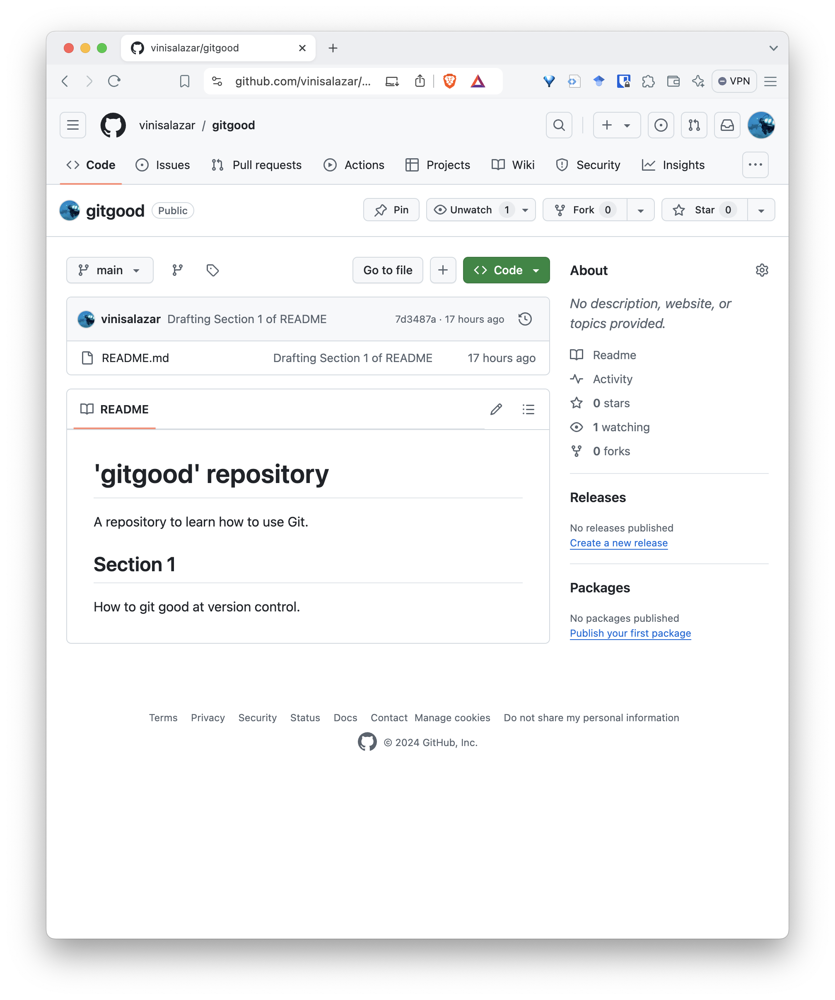
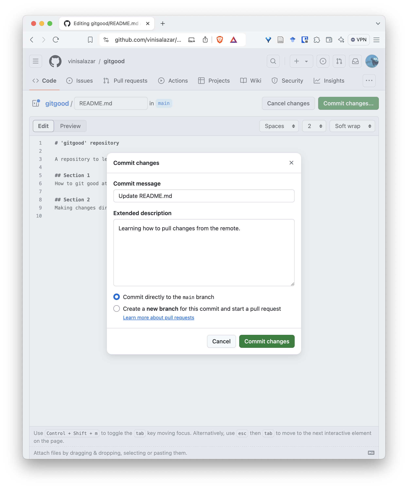

:::::::::::::::::::::::::::::::::::::: questions 

- How do we interact with Git remotes?
- What does *pushing* and *pulling* mean?

::::::::::::::::::::::::::::::::::::::::::::::::

::::::::::::::::::::::::::::::::::::: objectives

- "Push" our repository to GitHub.
- Learn the Git commands `push` and `pull`..

::::::::::::::::::::::::::::::::::::::::::::::::

### Pushing changes

Now that we've learned how to set up a *local* repository, let's **push** that to GitHub. Before we do that, let's have another look at the concept of [remotes](../learners/reference.md#glossary). We learned that remotes are a cloud copy of our repository. In order to push our repository to GitHub, we'll have to **set the remote** of our local repository to GitHub. 

1. Open GitHub, and click on the `+` button in the top right corner, and select "New repository"

2. Select a name for the repository. Usually we use the same name of the repository's parent directory.
    

3. On the following screen, you will have the commands to set the remote and push the repository from the command line.

Follow the commands on that screen and you will have succesfully pushed your repository to GitHub! On your repository, you can run `git remote -v` to see the URL of your new remote.

::::::::::::::::::::::::::::::::::::: callout

**SSH and HTTPS authentication** 

Notice that this page has two options for authentication: "SSH" or "HTTPS". If you followed the [SSH access step on the Setup section](#setup), you should be able to use the SSH option, which is the default and the recommended one. However, if that doesn't work, you can switch your remote to HTTPS by using `git remote set-url origin <HTTPS-URL-HERE>`.

:::::::::::::::::::::::::::::::::::::

Your new repository should look somewhat like this:

Notice how the `README.md` file that we wrote makes up the landing page of our repository. This is one of the reasons of why having a README is so important, especially for GitHub projects: it will be the "front page" of your project. You can (and should) write any important information here. 

We have successfully **pushed** our local repository from our local machine to the remote. Now, let's make a change directly on our remote and **pull** our changes locally.

### Pulling changes

1. On your new repository page, click on the pencil icon on the top-right side of the README.

2. Add a new section with level 2 headings (`##`) and write something. Click on "Commit changes" on the top right".

3. Write a descriptive commit message.

4. Your file should reflect the update you've just made. Notice the commit stamp on the top.

5. On your Terminal, navigate to your repository and run `git pull`.

::::::::::::::::::::::::::::::::::::: challenge 

**Syncing changes**
What do you think happens if you make a remote change, and then a local change, and you try to push the local changes **before** pulling the remote changes?

:::::::::::::::::::::::::::::::::::::

::::::::::::::::::::::::::::::::::::: keypoints 

- The `git push` command **pushes** local changes to the GitHub remote. Before running it, we must **set our remote** to the correct URL.
- The `git pull` command **pulls** remote changes to our local repository. We need to run it to sync our local repository to the newest updates on the remote.
- The `git remote` command is used to manage remotes, such as setting the GitHub URL, to view the configured remotes, and other actions.

::::::::::::::::::::::::::::::::::::::::::::::::

